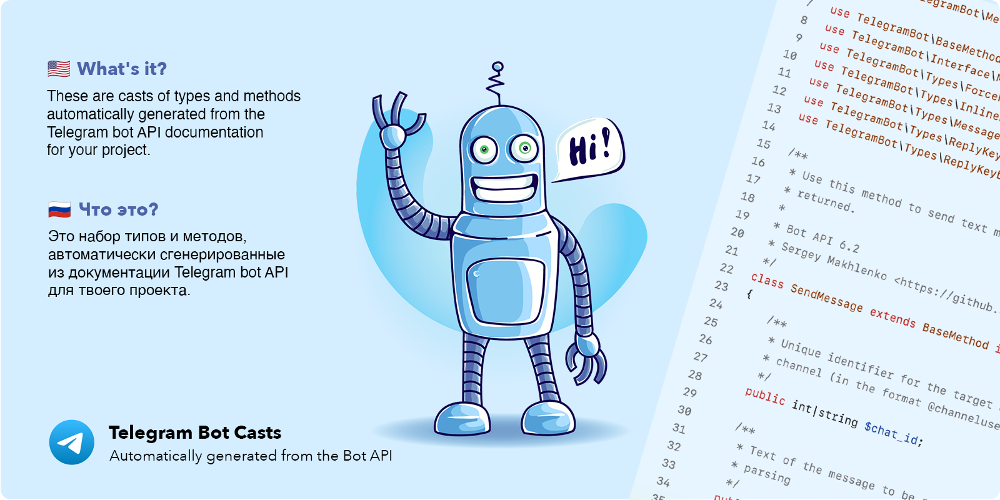

[](https://opensource.org/licenses/MIT)

Проект содержит описания всех типов и методов из документации Telegram Bot API.
Файлы сгенерированы автоматически с помощью malenko/telegram-api-parser. 
Вы можете попробовать сделать это самостоятельно, если файлы этого репозитория устареют.

# Простая установка

```shell
composer require makhlenko/telegram-bot-casts
```

## Расширение

Выполните подмену классов `TelegramBot\BaseType` и `TelegramBot\BaseMethod` используя 
инъекции зависимостей в своем проекте. 

### Расширение через `composer.json`

```json
{
     "autoload": {
       "files": [
         "your_app/path/to/BaseType.php",
         "your_app/path/to/BaseMethod.php"
       ]
     }
}
```
После этого обновите файл дампа:
```shell
composer dumpautoload
```

### Планы

В ближайшее время, попробую сделать обновление этого репозитория автоматически, 
чтобы всегда иметь актуальные типы и методы для ваших Telegram ботов, а вам не приходилось следить
за обновлениями версий Telegram Bot API.